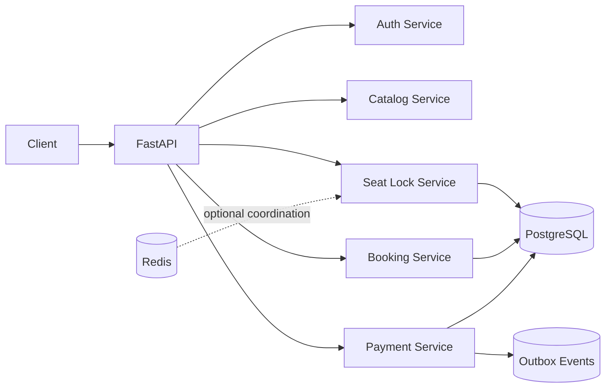

# SeatSync

**SeatSync** is a production-style, concurrent ticket-booking backend built to
demonstrate strong low-level design, database transactions, state machines,
payment idempotency, failure handling, and testable service architecture.

It is intentionally more than a CRUD clone. The central problem is ensuring
that two users cannot book the same seat while preserving a reliable payment
and confirmation workflow.

## Highlights

- Atomic, expiring seat reservations
- Double-booking prevention using conditional database updates
- Separate permanent `Seat` and per-show `ShowSeat` models
- Booking state machine
- Idempotent payment initiation
- Successful and failed mock-payment flows
- Outbox events for reliable notifications
- Role-based admin APIs
- JWT authentication with PBKDF2 password hashing
- PostgreSQL, Redis and Docker Compose setup
- SQLite zero-configuration local mode
- Automated tests and GitHub Actions CI
- Mermaid architecture and sequence diagrams

## Architecture



Read the detailed design in [`docs/architecture.md`](docs/architecture.md).

## Technology

- Python 3.11+
- FastAPI
- SQLAlchemy 2
- PostgreSQL for production-style execution
- SQLite for zero-setup local development
- Redis included for future distributed-lock/cache extensions
- Alembic migrations
- Pytest
- Docker Compose
- GitHub Actions

## Quick start: local SQLite

```bash
python -m venv .venv
source .venv/bin/activate       # Windows: .venv\Scripts\activate
pip install -e ".[dev]"
# Alternative: pip install -r requirements-dev.txt
cp .env.example .env
alembic upgrade head
python scripts/seed.py
uvicorn app.main:app --reload
```

Open:

- Interactive demo: `http://localhost:8000/demo`
- API documentation: `http://localhost:8000/docs`
- Health endpoint: `http://localhost:8000/api/v1/health`

Demo credentials:

| Role | Email | Password |
|---|---|---|
| Admin | `admin@seatsync.dev` | `Admin@12345` |
| Customer | `demo@seatsync.dev` | `Demo@12345` |

Change these credentials before any public deployment.

## Quick start: Docker

```bash
cp .env.example .env
docker compose up --build
```

The API will be available at `http://localhost:8000`.

The repository includes an initial Alembic migration and the Docker entrypoint
applies it automatically before seeding demo data.

## Main workflow

1. Register or log in.
2. Browse movies and shows.
3. Fetch the seat map.
4. Lock available seats.
5. Create a pending booking from the lock token.
6. Initiate payment using an idempotency key.
7. Submit a mock gateway result.
8. Observe the booking become confirmed or the seats become available again.

See complete commands in [`docs/api-examples.md`](docs/api-examples.md).

## Core endpoints

| Method | Endpoint | Purpose |
|---|---|---|
| POST | `/api/v1/auth/register` | Create customer account |
| POST | `/api/v1/auth/login` | Obtain access token |
| GET | `/api/v1/movies` | List movies |
| GET | `/api/v1/movies/{id}/shows` | List showtimes |
| GET | `/api/v1/shows/{id}/seats` | Retrieve current seat map |
| POST | `/api/v1/seat-locks` | Atomically lock seats |
| POST | `/api/v1/bookings` | Create pending booking |
| POST | `/api/v1/payments` | Initiate idempotent payment |
| POST | `/api/v1/payments/{id}/mock-result` | Simulate gateway result |
| POST | `/api/v1/bookings/{id}/cancel` | Cancel or refund booking |
| POST | `/api/v1/admin/*` | Manage catalogue |

## The central concurrency guarantee

SeatSync does not first read a seat and then blindly update it. It uses a
conditional update whose predicate requires the seat to still be `AVAILABLE`.
If the number of affected rows differs from the number requested, the whole
transaction is rolled back.

This avoids the classic race:

```text
User A reads AVAILABLE
User B reads AVAILABLE
User A books
User B books  <-- incorrect
```

The database decides the winner atomically.

## State transitions

```text
AVAILABLE -> LOCKED -> BOOKED
    ^          |
    |          +-> AVAILABLE after expiry or failed payment
    +------------- AVAILABLE after cancellation/refund
```

```text
PENDING_PAYMENT -> CONFIRMED
       |              |
       |              +-> REFUNDED
       +-> PAYMENT_FAILED
       +-> EXPIRED
       +-> CANCELLED
```

## Tests

```bash
pytest
pytest --cov=app --cov-report=term-missing
```

The suite covers:

- Registration and authentication
- Duplicate-account protection
- Successful booking and payment
- Double-lock rejection
- Failed-payment seat release
- Payment idempotency
- Admin authorization

Run the live race demonstration after starting the API:

```bash
python scripts/demo_race.py
```

Ten requests compete for one seat; exactly one should receive HTTP 201.

## Repository structure

```text
app/
├── api/              # HTTP routes and dependencies
├── core/             # Configuration and security
├── db/               # SQLAlchemy base and sessions
├── models/           # Persistence models and enums
├── repositories/     # Data-access abstractions
├── schemas/          # Request and response contracts
├── services/         # Business and domain logic
└── workers/          # Maintenance/background entry points

docs/                 # Architecture, sequence, API and interview guides
migrations/           # Alembic environment
scripts/              # Seed and concurrency demo
tests/                # Automated tests
```

## Production improvements

The project is complete for an internship portfolio and local demonstration,
but a real commercial deployment should additionally implement:

- Signed real-gateway webhooks and reconciliation
- Automated refunds for late payment success
- Redis locks with fencing tokens as an optimization
- Dedicated outbox publisher and message broker
- Email/SMS notification adapters
- Rate limiting, bot protection and waiting rooms
- Metrics, tracing and centralized logs
- PostgreSQL load and race testing
- Refresh tokens and verified accounts
- Secret manager and managed infrastructure

## How to present this in an interview

Do not describe it as “a BookMyShow clone.” Say:

> I built a concurrent reservation and payment backend. The difficult part was
> preventing double booking across multiple requests while handling abandoned
> locks, duplicate payment attempts and server failure boundaries.

Then explain:

1. Why `Seat` and `ShowSeat` are separate.
2. Why a conditional database update is safer than check-then-update.
3. How lock expiration works.
4. How idempotency keys protect payment initiation.
5. Why outbox events are committed with booking confirmation.

A longer interview preparation guide is available in
[`docs/interview-guide.md`](docs/interview-guide.md).

## Resume bullets

- Built a concurrent ticket-reservation backend using FastAPI, SQLAlchemy,
  PostgreSQL and Redis-ready coordination, preventing double booking through
  atomic conditional seat updates and expiring lock tokens.
- Designed an idempotent payment workflow and booking state machine covering
  confirmation, failure, expiry, cancellation and refund paths.
- Structured the system using service, repository, strategy and outbox
  patterns; added Docker, CI, API documentation, diagrams and automated tests.

## License

MIT
