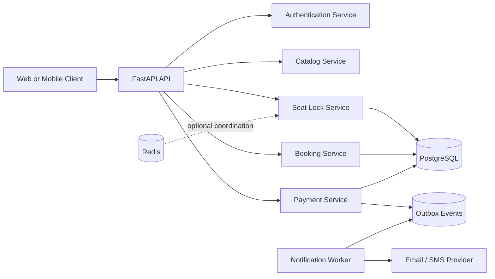

# Architecture

## Component diagram



## Why `Seat` and `ShowSeat` are separate

`Seat` represents a permanent physical seat such as A10 in Screen 1. `ShowSeat`
represents that seat for one show and owns the mutable booking state and price.
Putting availability on `Seat` would make one booking incorrectly affect every
show running in the screen.

## Concurrency model

The lock operation uses one conditional database update:

```sql
UPDATE show_seats
SET status = 'LOCKED', lock_token = :token
WHERE show_id = :show_id
  AND id IN (:seat_ids)
  AND status = 'AVAILABLE';
```

The transaction succeeds only when the affected-row count equals the number of
requested seats. A mismatch triggers a rollback, preventing partial locks and
double booking.

## Reliability model

- High-entropy seat-lock tokens identify one reservation attempt.
- Lock expiration releases abandoned seats.
- Payment idempotency keys prevent duplicate payment records.
- Booking state transitions reject invalid operations.
- Outbox events are committed in the same transaction as booking confirmation.
- External notifications can be retried without changing booking state.
