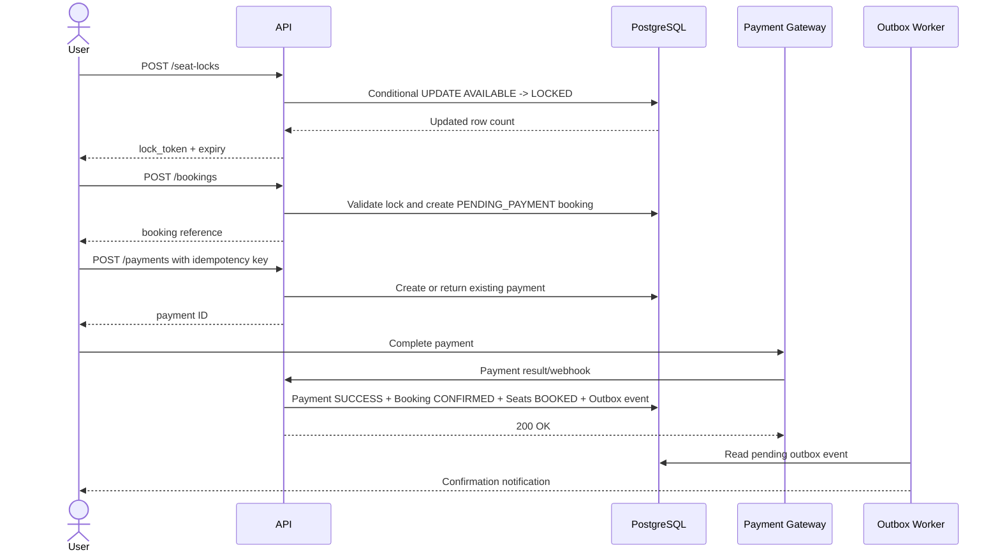

# Booking sequence

```mermaid
sequenceDiagram
    actor U as User
    participant API
    participant DB as PostgreSQL
    participant PG as Payment Gateway
    participant O as Outbox Worker

    U->>API: POST /seat-locks
    API->>DB: Conditional UPDATE AVAILABLE -> LOCKED
    DB-->>API: Updated row count
    API-->>U: lock_token + expiry

    U->>API: POST /bookings
    API->>DB: Validate lock and create PENDING_PAYMENT booking
    API-->>U: booking reference

    U->>API: POST /payments with idempotency key
    API->>DB: Create or return existing payment
    API-->>U: payment ID

    U->>PG: Complete payment
    PG->>API: Payment result/webhook
    API->>DB: Payment SUCCESS + Booking CONFIRMED + Seats BOOKED + Outbox event
    API-->>PG: 200 OK
    O->>DB: Read pending outbox event
    O-->>U: Confirmation notification
```
